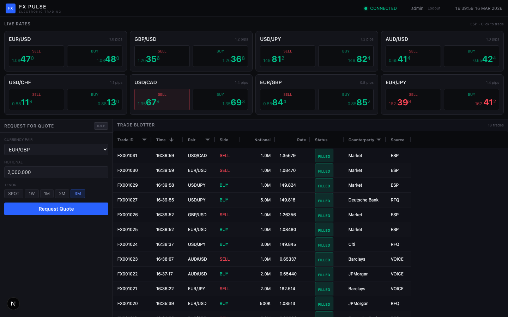

# FX Pulse

**FX Pulse** is a realistic, real-time FX electronic trading platform built to demonstrate AI-powered Playwright testing on a complex, interactive trading UI. It simulates a professional institutional FX workspace using fully mocked, in-memory data with no backend required.



## Demo

<video src="video-demo.mp4" controls width="100%"></video>

---

## Design

FX Pulse uses a professional dark theme with industry-standard trading colors for instant visual clarity.

| Element | Style |
|---|---|
| Base palette | Dark charcoal (`#0C0D10`) |
| Primary accent | Blue (`#2962FF`) |
| Buy / Positive | Green (`#00C48C`) |
| Sell / Negative | Red (`#FF4757`) |
| Pending / Warning | Amber (`#FFB020`) |

---

## Features

- **Login** — mock authentication with `admin` / `admin` credentials
- **Live Rate Tiles** — 8 currency pairs with prices updating every 200ms–2s via random walk simulation
- **Click-to-Trade** — click BID to SELL, ASK to BUY; trade appears instantly in the blotter
- **RFQ Workflow** — submit a Request for Quote, receive staggered dealer quotes from 4 banks, accept or reject
- **Trade Blotter** — AG Grid table with filtering, sorting, and live updates from ESP and RFQ trades

See [docs/FEATURES.md](docs/FEATURES.md) for full feature documentation with screenshots.

---

## Tech Stack

| Layer | Technology |
|---|---|
| Framework | Next.js 16 (App Router, TypeScript) |
| Grid | AG Grid Community |
| Styling | Tailwind CSS v4 |
| Browser testing | Playwright |
| Data | In-memory mocked simulation |

---

## Getting Started

```bash
npm install
npm run dev
```

Open [http://localhost:3000](http://localhost:3000). Login with `admin` / `admin`.

### Other commands

```bash
npm run build    # production build
npm run lint     # ESLint
```

---

## Project Structure

```
src/
├── app/
│   ├── layout.tsx              # Root layout, dark theme
│   ├── page.tsx                # Main workspace (CSS Grid)
│   └── globals.css             # Tailwind + theme vars
├── components/
│   ├── Header.tsx              # App bar: logo, clock, connection status
│   ├── LoginPage.tsx           # Login form (admin/admin)
│   ├── rate-tiles/
│   │   ├── RateTilesPanel.tsx  # 4×2 grid container
│   │   ├── RateTile.tsx        # Single tile with flash animation
│   │   └── PriceDisplay.tsx    # Big-figure / pips / fractional pip
│   ├── rfq/
│   │   ├── RfqPanel.tsx        # RFQ container
│   │   ├── RfqForm.tsx         # Pair, notional, tenor, submit
│   │   ├── DealerQuoteCard.tsx # Dealer quote with accept buttons
│   │   └── RfqStatusBadge.tsx  # Colored status pill
│   └── blotter/
│       ├── TradeBlotter.tsx    # AG Grid trade history
│       └── StatusCellRenderer.tsx
├── context/
│   ├── AuthContext.tsx          # Mock authentication (admin/admin)
│   └── TradingContext.tsx      # Central state: rates, trades, RFQ
├── hooks/
│   ├── usePriceStream.ts       # Price subscription hook
│   └── useRfq.ts               # RFQ lifecycle + expiry timer
└── lib/
    ├── types.ts                # TypeScript interfaces
    ├── currencyPairs.ts        # 8 pair configs with base rates
    ├── priceEngine.ts          # Random walk price simulation
    ├── rfqSimulator.ts         # Dealer quote generation
    └── tradeUtils.ts           # Trade ID, formatting, seed data
docs/
├── FEATURES.md                 # Full feature docs with screenshots
├── fx-pulse.feature            # Cucumber-style workflow specification
└── screenshots/                # UI screenshots for documentation
scripts/
└── capture-screenshots.mjs    # Playwright screenshot script
```

---

## Playwright Testing

All key UI elements have `data-testid` attributes for reliable Playwright selectors:

| Element | Selector |
|---|---|
| Login form | `[data-testid="login-form"]` |
| Username input | `[data-testid="username-input"]` |
| Password input | `[data-testid="password-input"]` |
| Sign in button | `[data-testid="login-submit-btn"]` |
| Rate tile (e.g. EUR/USD) | `[data-testid="rate-tile-EURUSD"]` |
| Buy button | `[data-testid="buy-btn-EURUSD"]` |
| Sell button | `[data-testid="sell-btn-EURUSD"]` |
| RFQ form | `[data-testid="rfq-form"]` |
| Pair selector | `[data-testid="rfq-pair-select"]` |
| Notional input | `[data-testid="rfq-notional-input"]` |
| Tenor pill | `[data-testid="tenor-SPOT"]` |
| Submit button | `[data-testid="rfq-submit-btn"]` |
| RFQ status badge | `[data-testid="rfq-status"]` |
| Dealer quote card | `[data-testid="dealer-quote-DeutscheBank"]` |
| Accept buy | `[data-testid="accept-buy-JPMorgan"]` |
| Trade blotter grid | `[data-testid="trade-blotter"]` |
| Connection status | `[data-testid="connection-status"]` |
| Clock | `[data-testid="clock"]` |
| Logout button | `[data-testid="logout-btn"]` |
