# FX Pulse — Feature Documentation

FX Pulse is a browser-based FX electronic trading platform with live rate streaming, click-to-trade execution, an RFQ (Request for Quote) workflow, and a real-time trade blotter. All data is simulated in-memory — no backend required.

---

## Table of Contents

1. [Login](#1-login)
2. [Application Overview](#2-application-overview)
3. [Header Bar](#3-header-bar)
4. [Live Rate Tiles](#4-live-rate-tiles)
5. [Click-to-Trade](#5-click-to-trade)
6. [Request for Quote (RFQ)](#6-request-for-quote-rfq)
   - [Submitting an RFQ](#submitting-an-rfq)
   - [Dealer Quotes Arriving](#dealer-quotes-arriving)
   - [Accepting a Quote](#accepting-a-quote)
   - [Rejecting Quotes](#rejecting-quotes)
   - [RFQ Expiry](#rfq-expiry)
7. [Trade Blotter](#7-trade-blotter)
8. [Supported Currency Pairs](#8-supported-currency-pairs)
9. [Playwright Test Selectors](#9-playwright-test-selectors)

---

## 1. Login

Users must authenticate before accessing the trading workspace. The login page presents a centered form with the FX Pulse branding.

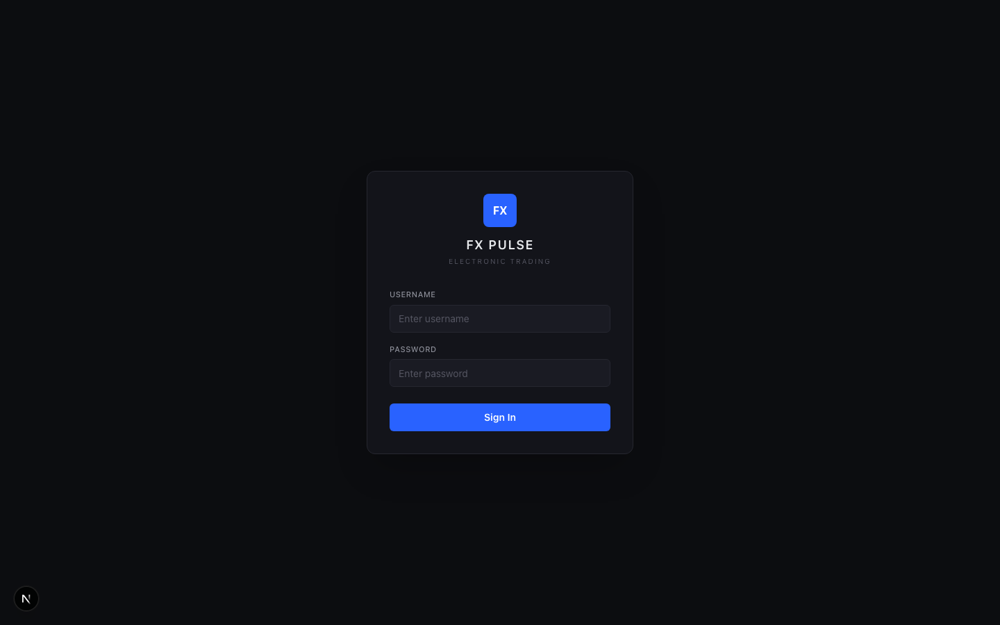

- **Credentials:** `admin` / `admin`
- Session persists via `sessionStorage` (survives page refresh within the same tab)
- Invalid credentials display a red error message below the form
- On success, the user is taken to the trading dashboard

**Selectors:**

| Element | Selector |
|---|---|
| Login form | `[data-testid="login-form"]` |
| Username | `[data-testid="username-input"]` |
| Password | `[data-testid="password-input"]` |
| Sign In | `[data-testid="login-submit-btn"]` |
| Error | `[data-testid="login-error"]` |

---

## 2. Application Overview

FX Pulse presents a single-page trading workspace with three main zones:

```
┌─────────────────────────────────────────────────────┐
│  Header bar — logo, user, clock, connection status   │
├─────────────────────────────────────────────────────┤
│  Live Rate Tiles — 8 currency pairs (4 × 2 grid)    │
├──────────────────────┬──────────────────────────────┤
│  RFQ Panel           │  Trade Blotter (AG Grid)      │
│  (320px fixed)       │  (remaining width)            │
└──────────────────────┴──────────────────────────────┘
```

The design uses a professional dark theme with industry-standard colors: blue (`#2962FF`) for primary actions, green (`#00C48C`) for buy/positive, red (`#FF4757`) for sell/negative, and amber (`#FFB020`) for pending states.

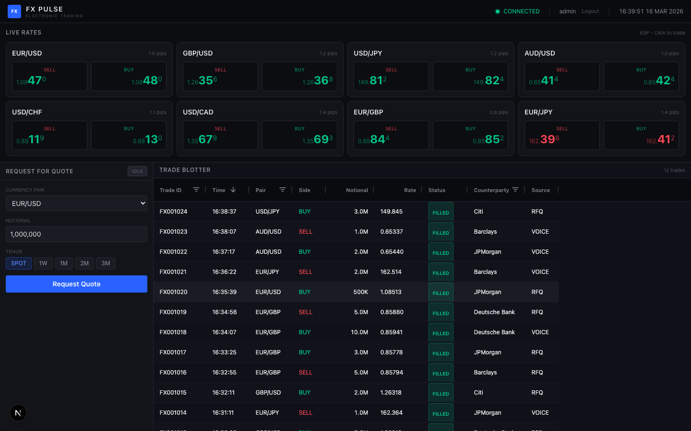

---

## 3. Header Bar

The header bar (`data-testid="header"`) contains:

- **FX Pulse logo** — blue icon with app name and "Electronic Trading" subtitle
- **Connection status indicator** (`data-testid="connection-status"`) — glowing green dot + "CONNECTED" text. Occasionally flickers to "RECONNECTING..." (red) to simulate network latency.
- **User info** — logged-in username and logout button
- **Live clock** (`data-testid="clock"`) — real-time HH:MM:SS DD MON YYYY updated every second.

---

## 4. Live Rate Tiles

Eight currency pairs are displayed in a 4 × 2 grid, each updating independently. Key pairs (EUR/USD, GBP/USD, USD/JPY, EUR/JPY) tick every 200–600ms; others tick every 500ms–2s.

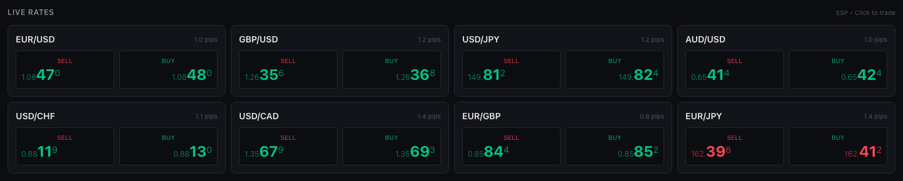

### Price Display Format

Prices use professional big-figure / pips / fractional-pip formatting:

```
EUR/USD:  1.08  45  6
         ────  ──  ─
         big  pips frac
         fig
```

For JPY pairs (USD/JPY, EUR/JPY), the decimal structure shifts:

```
USD/JPY:  149.  85  2
```

### Flash Animation

When a price moves up, the tile border flashes **green**. When it moves down, it flashes **red**. The flash lasts 300ms.

### Supported Pairs

| Pair | Testid |
|---|---|
| EUR/USD | `rate-tile-EURUSD` |
| GBP/USD | `rate-tile-GBPUSD` |
| USD/JPY | `rate-tile-USDJPY` |
| AUD/USD | `rate-tile-AUDUSD` |
| USD/CHF | `rate-tile-USDCHF` |
| USD/CAD | `rate-tile-USDCAD` |
| EUR/GBP | `rate-tile-EURGBP` |
| EUR/JPY | `rate-tile-EURJPY` |

---

## 5. Click-to-Trade

Clicking the **SELL** button on any tile executes a trade at the current **BID** price. Clicking **BUY** executes at the current **ASK** price.

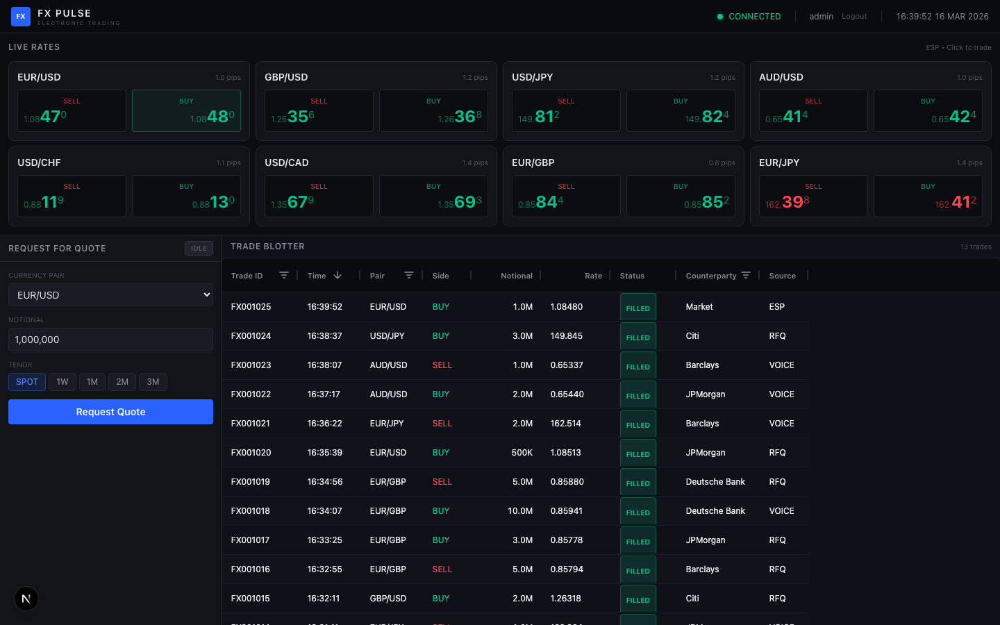

- Default notional: **1,000,000** (1M)
- Counterparty: `Market`
- Source: `ESP` (Electronic Streaming Price)
- Trade appears instantly at the top of the blotter with status **FILLED**

**Selectors:**

```
[data-testid="buy-btn-EURUSD"]   → Buy EUR/USD at ASK
[data-testid="sell-btn-EURUSD"]  → Sell EUR/USD at BID
```

---

## 6. Request for Quote (RFQ)

The RFQ panel (`data-testid="rfq-panel"`) enables soliciting competitive quotes from multiple dealers before executing.

### RFQ Status Flow

```
IDLE → PENDING → QUOTED → ACCEPTED
                        ↘ REJECTED
                        ↘ EXPIRED (after 30s)
```

Status badges:
- **IDLE** — muted gray
- **PENDING** — amber (`#FFB020`), pulsing
- **QUOTED** — blue (`#2962FF`)
- **ACCEPTED** — green (`#00C48C`)
- **REJECTED** — red (`#FF4757`)
- **EXPIRED** — amber (`#FFB020`)

### Submitting an RFQ

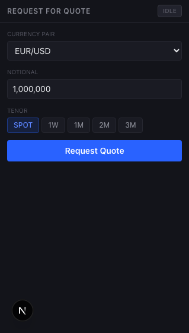

The form fields are:

| Field | Selector | Description |
|---|---|---|
| Currency Pair | `[data-testid="rfq-pair-select"]` | Dropdown with all 8 pairs |
| Notional | `[data-testid="rfq-notional-input"]` | Amount formatted with commas |
| Tenor | `[data-testid="tenor-SPOT"]` etc. | Pills: SPOT, 1W, 1M, 2M, 3M |
| Submit | `[data-testid="rfq-submit-btn"]` | Blue button |

On submit, the status changes to **PENDING** (amber, pulsing) and the form is disabled. A countdown timer appears showing seconds remaining.

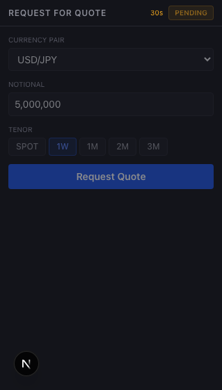

### Dealer Quotes Arriving

Quotes arrive staggered (500ms–3000ms) from four dealers:

- Deutsche Bank
- Barclays
- Citi
- JPMorgan

Each dealer provides a **BID** and **ASK**. The dealer offering the best overall price receives a **BEST** badge (blue). The quote counter shows `(1/4)`, `(2/4)`, etc. as quotes arrive.

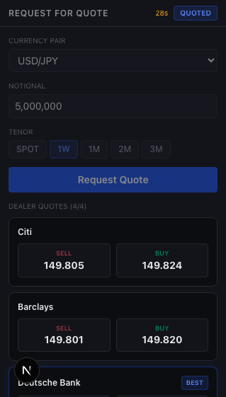

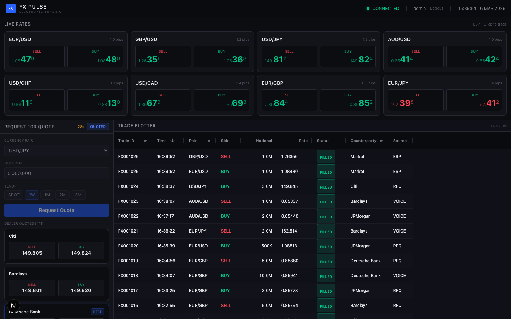

### Accepting a Quote

Click **Buy** or **Sell** on any dealer card to accept their quote at the corresponding ASK or BID.

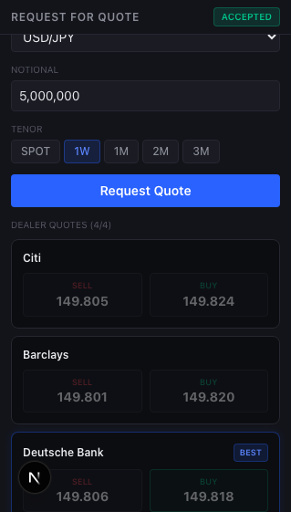

- Status changes to **ACCEPTED** (green)
- A trade is booked to the blotter with `Source: RFQ` and the dealer as counterparty
- All quote buttons become disabled
- A "New RFQ" link appears (blue) to start a fresh request

**Selectors:**

```
[data-testid="accept-buy-JPMorgan"]        → Accept JPMorgan's ASK
[data-testid="accept-sell-DeutscheBank"]   → Accept Deutsche Bank's BID
```

### Rejecting Quotes

When at least one quote has arrived, a **Reject All** button (`data-testid="rfq-reject-btn"`) appears in red.

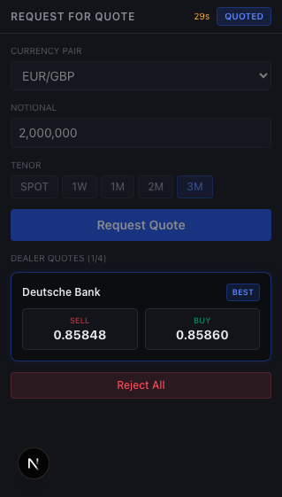

Clicking it:
- Cancels the RFQ
- Sets status to **REJECTED** (red)
- No trade is booked

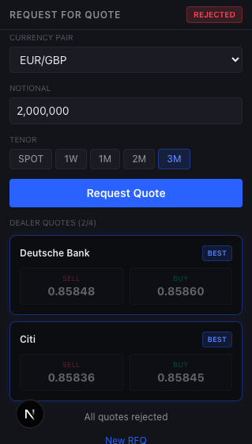

### RFQ Expiry

If no quote is accepted within **30 seconds**, the RFQ expires automatically:

- Status changes to **EXPIRED** (amber)
- All quote buttons are disabled
- The countdown timer disappears
- A "New RFQ" link appears

---

## 7. Trade Blotter

The trade blotter (`data-testid="trade-blotter"`) is an AG Grid table that records all executed trades.

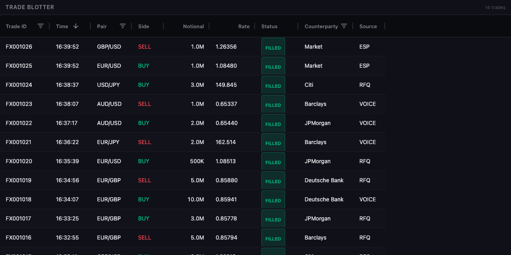

### Columns

| Column | Description |
|---|---|
| Trade ID | Unique ID, e.g. `FX001042` |
| Time | Execution timestamp (HH:MM:SS) |
| Pair | Currency pair |
| Side | **BUY** (green) / **SELL** (red) |
| Notional | Formatted amount (e.g. `5.0M`, `500K`) |
| Rate | Execution rate (5dp for major pairs, 3dp for JPY) |
| Status | Colored badge: `FILLED` (green) / `PENDING` (amber) / `REJECTED` (red) |
| Counterparty | `Market` (ESP trades) or dealer name (RFQ trades) |
| Source | `ESP`, `RFQ`, or `VOICE` |

### Features

- **Sorting** — click any column header to sort ascending/descending
- **Filtering** — column-level filters on Trade ID, Pair, Counterparty
- **Live updates** — new trades prepend to the top automatically with row animation
- **Pre-seeded** — 12 realistic seed trades on load for a populated look
- **Blue accent** — AG Grid accent color uses blue for selection highlights

### Pre-loaded Seed Data

On app load, 12 historical trades are generated spanning ~10 minutes of history, with randomised pairs, directions, notionals, dealers, and sources.

---

## 8. Supported Currency Pairs

| Pair | Base Rate | Spread | Volatility | Tick Speed |
|---|---|---|---|---|
| EUR/USD | 1.0845 | 0.8 pips | Very High | 200–600ms |
| GBP/USD | 1.2634 | 1.0 pips | High | 200–600ms |
| USD/JPY | 149.85 | 1.2 pips | Very High | 200–600ms |
| AUD/USD | 0.6542 | 1.0 pips | High | 500–2000ms |
| USD/CHF | 0.8812 | 1.2 pips | Moderate | 500–2000ms |
| USD/CAD | 1.3567 | 1.4 pips | Moderate | 500–2000ms |
| EUR/GBP | 0.8585 | 0.9 pips | Low | 500–2000ms |
| EUR/JPY | 162.45 | 1.5 pips | High | 200–600ms |

Prices use a Gaussian random walk with mean reversion toward the base rate to stay realistic over time.

---

## 9. Playwright Test Selectors

All interactive elements expose `data-testid` attributes for reliable Playwright automation.

### Login

```js
page.getByTestId('login-form')
page.getByTestId('username-input')
page.getByTestId('password-input')
page.getByTestId('login-submit-btn')
page.getByTestId('login-error')
```

### Header

```js
page.getByTestId('header')
page.getByTestId('connection-status')
page.getByTestId('clock')
page.getByTestId('logged-in-user')
page.getByTestId('logout-btn')
```

### Rate Tiles

```js
page.getByTestId('rate-tiles-panel')
page.getByTestId('rate-tile-EURUSD')     // any pair, no slash
page.getByTestId('buy-btn-EURUSD')
page.getByTestId('sell-btn-EURUSD')
```

### RFQ

```js
page.getByTestId('rfq-panel')
page.getByTestId('rfq-form')
page.getByTestId('rfq-pair-select')
page.getByTestId('rfq-notional-input')
page.getByTestId('rfq-tenor-pills')
page.getByTestId('tenor-SPOT')           // SPOT | 1W | 1M | 2M | 3M
page.getByTestId('rfq-submit-btn')
page.getByTestId('rfq-status')           // status badge text
page.getByTestId('rfq-timer')            // countdown (seconds)
page.getByTestId('rfq-quotes')           // quotes container
page.getByTestId('rfq-reject-btn')
page.getByTestId('rfq-new-btn')
// Dealer cards
page.getByTestId('dealer-quote-JPMorgan')
page.getByTestId('accept-buy-JPMorgan')
page.getByTestId('accept-sell-DeutscheBank')
```

### Trade Blotter

```js
page.getByTestId('trade-blotter')
```

### Example: Login + Trade

```js
// Login
await page.fill('[data-testid="username-input"]', 'admin');
await page.fill('[data-testid="password-input"]', 'admin');
await page.click('[data-testid="login-submit-btn"]');
await page.waitForSelector('[data-testid="rate-tiles-panel"]');

// Click-to-trade
await page.click('[data-testid="buy-btn-EURUSD"]');
const firstRow = page.locator('[data-testid="trade-blotter"] .ag-row').first();
await expect(firstRow).toContainText('EUR/USD');
await expect(firstRow).toContainText('BUY');
```

### Example: Full RFQ workflow

```js
// Submit RFQ
await page.selectOption('[data-testid="rfq-pair-select"]', 'EUR/USD');
await page.fill('[data-testid="rfq-notional-input"]', '5,000,000');
await page.click('[data-testid="tenor-1M"]');
await page.click('[data-testid="rfq-submit-btn"]');

// Wait for all quotes
await page.waitForFunction(() =>
  document.body.textContent.includes('4/4')
);

// Accept best quote
await page.click('[data-testid^="accept-buy-"]');

// Verify trade booked
await expect(page.getByTestId('rfq-status')).toHaveText('ACCEPTED');
```
